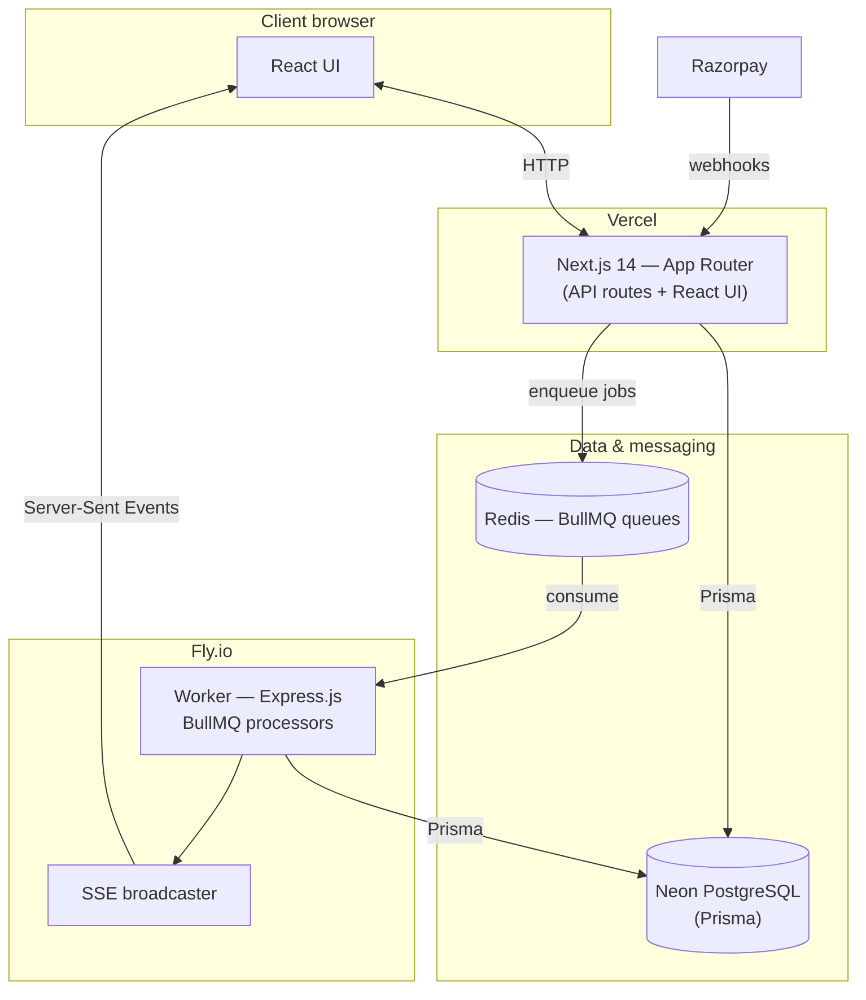

# DropFlow — System Architecture

DropFlow is a multi-tenant dropshipping and D2C platform. This document describes how the main pieces connect and why key technologies were chosen.

## System Architecture

## Monorepo packages

| Package | Purpose | Key exports |
|---------|---------|-------------|
| `@dropflow/db` | Prisma client, schema, seed | `prisma`, `PrismaClient`, `Prisma` |
| `@dropflow/config` | Shared enums, constants, carrier data | `TenantPlan`, `OrderStatus`, `CARRIERS`, `PAGINATION` |
| `@dropflow/gst` | Indian GST engine (HSN, GSTIN validation) | `calculateGST`, `validateGSTIN`, `formatINR`, `STATE_CODES` |
| `@dropflow/types` | Zod schemas for API validation | `CreateOrderSchema`, `CreateProductSchema`, etc. |

## Applications

### Web (`apps/web`)

- Next.js 14 App Router on Vercel
- Clerk authentication with middleware protection
- E2E test bypass via `x-e2e-test-key` header in development
- API routes under `/api/v1/`
- Dashboard pages under `/(dashboard)/`
- shadcn/ui component library

### Worker (`apps/worker`)

- Express.js on Fly.io
- BullMQ job processor
- DAG workflow executor with topological sort
- SSE broadcaster for real-time updates
- Pino structured logging

## Design decisions

1. **Monorepo over microservices** — Shared types, one deploy story, simpler developer experience.
2. **DAG executor over LangGraph** — Workflow steps are deterministic; no LLM reasoning required. Faster, no model cost, fully auditable.
3. **Neon over self-hosted PostgreSQL** — Serverless scaling, database branching for development, minimal operations.
4. **Prisma over raw SQL** — Type-safe queries, schema-as-code, first-class migrations.
5. **BullMQ over SQS** — Redis colocated with the worker on Fly.io, rich job semantics (retries, delays, flows).
6. **E2E test bypass pattern** — Custom header plus environment variable to skip Clerk only in development; not enabled in production, so it is not a production security exposure.

## Changelog

- **2026-03-30:** Initial architecture established.
