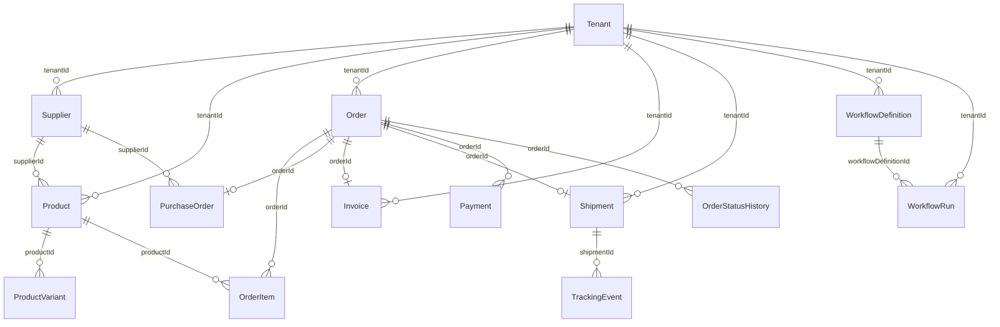

# DropFlow data model

Reference for the Prisma schema in `packages/db/prisma/schema.prisma`.

## Overview

The database is **PostgreSQL** (hosted on **Neon**), accessed via **Prisma ORM**. The schema defines **14 models** and **10 enums**.

## Entity relationship diagram

`Order.workflowRunId` is an optional string reference to a workflow run; there is no Prisma `@relation` from `Order` to `WorkflowRun` in the schema.

## Models

### Tenant

| Field | Type | Constraints | Description |
| --- | --- | --- | --- |
| `id` | String | PK, `cuid()` | Tenant identifier |
| `clerkOrgId` | String | unique | Clerk organization id |
| `slug` | String | unique | URL-safe tenant slug |
| `name` | String | | Display name |
| `plan` | TenantPlan | default `STARTER` | Subscription plan |
| `gstin` | String? | | GSTIN (optional) |
| `pan` | String? | | PAN (optional) |
| `iecCode` | String? | | IEC code (optional) |
| `defaultCurrency` | Currency | default `INR` | Default currency |
| `sellerStateCode` | String? | | Seller state code (optional) |
| `workflowConfigJson` | Json | default `{}` | Workflow configuration |
| `isActive` | Boolean | default `true` | Whether tenant is active |
| `createdAt` | DateTime | default `now()` | Created timestamp |
| `updatedAt` | DateTime | `@updatedAt` | Last update timestamp |

### Supplier

| Field | Type | Constraints | Description |
| --- | --- | --- | --- |
| `id` | String | PK, `cuid()` | Supplier identifier |
| `tenantId` | String | FK → Tenant.id | Owning tenant |
| `name` | String | | Supplier name |
| `contactEmail` | String? | | Contact email |
| `contactPhone` | String? | | Contact phone |
| `gstin` | String? | | GSTIN |
| `status` | SupplierStatus | default `ACTIVE` | Lifecycle status |
| `leadTimeDays` | Int | default `3` | Typical lead time in days |
| `returnWindowDays` | Int | default `7` | Return window in days |
| `metaJson` | Json | default `{}` | Extensible metadata |
| `createdAt` | DateTime | default `now()` | Created timestamp |
| `updatedAt` | DateTime | `@updatedAt` | Last update timestamp |

### Product

| Field | Type | Constraints | Description |
| --- | --- | --- | --- |
| `id` | String | PK, `cuid()` | Product identifier |
| `tenantId` | String | FK → Tenant.id | Owning tenant |
| `supplierId` | String | FK → Supplier.id | Sourcing supplier |
| `sku` | String | unique with `tenantId` | SKU within tenant |
| `name` | String | | Product name |
| `description` | String? | | Description |
| `hsnCode` | String | | HSN code |
| `costPricePaise` | Int | | Cost in paise |
| `sellingPricePaise` | Int | | List/sell price in paise |
| `marginPercent` | Float | | Margin percentage |
| `gstRatePercent` | Int | | GST rate percentage |
| `stockQty` | Int | default `0` | On-hand quantity |
| `reservedQty` | Int | default `0` | Reserved quantity |
| `lowStockThreshold` | Int | default `10` | Low-stock alert threshold |
| `isActive` | Boolean | default `true` | Active flag |
| `isListed` | Boolean | default `true` | Listed for sale |
| `images` | String[] | | Image URLs or keys |
| `metaJson` | Json | default `{}` | Extensible metadata |
| `createdAt` | DateTime | default `now()` | Created timestamp |
| `updatedAt` | DateTime | `@updatedAt` | Last update timestamp |

### Order

| Field | Type | Constraints | Description |
| --- | --- | --- | --- |
| `id` | String | PK, `cuid()` | Order identifier |
| `tenantId` | String | FK → Tenant.id | Owning tenant |
| `orderNumber` | String | | Human-facing order number |
| `buyerName` | String | | Buyer name |
| `buyerEmail` | String | | Buyer email |
| `buyerPhone` | String | | Buyer phone |
| `shippingAddress` | Json | | Shipping address payload |
| `billingAddress` | Json | | Billing address payload |
| `status` | OrderStatus | default `PENDING` | Order lifecycle status |
| `currency` | Currency | default `INR` | Order currency |
| `subtotalPaise` | Int | | Subtotal in paise |
| `discountPaise` | Int | default `0` | Discount in paise |
| `shippingFeePaise` | Int | default `0` | Shipping fee in paise |
| `totalPaise` | Int | | Grand total in paise |
| `taxPaise` | Int | | Tax total in paise |
| `notes` | String? | | Internal or customer notes |
| `workflowRunId` | String? | | Optional workflow run id (no Prisma relation) |
| `createdAt` | DateTime | default `now()` | Created timestamp |
| `updatedAt` | DateTime | `@updatedAt` | Last update timestamp |

### OrderItem

| Field | Type | Constraints | Description |
| --- | --- | --- | --- |
| `id` | String | PK, `cuid()` | Line identifier |
| `orderId` | String | FK → Order.id | Parent order |
| `tenantId` | String | | Tenant scope (denormalized) |
| `productId` | String | FK → Product.id | Product |
| `variantId` | String? | | Optional variant id (no Prisma relation) |
| `quantity` | Int | | Quantity ordered |
| `unitPricePaise` | Int | | Unit price in paise |
| `totalPaise` | Int | | Line total in paise |
| `hsnCode` | String | | HSN at time of order |

### Invoice

| Field | Type | Constraints | Description |
| --- | --- | --- | --- |
| `id` | String | PK, `cuid()` | Invoice identifier |
| `orderId` | String | unique, FK → Order.id | One invoice per order |
| `tenantId` | String | FK → Tenant.id | Owning tenant |
| `invoiceNumber` | String | | Invoice number |
| `gstType` | GSTType | | GST treatment |
| `subtotalPaise` | Int | | Taxable subtotal in paise |
| `cgstPaise` | Int | default `0` | CGST in paise |
| `sgstPaise` | Int | default `0` | SGST in paise |
| `igstPaise` | Int | default `0` | IGST in paise |
| `totalTaxPaise` | Int | | Total tax in paise |
| `totalPaise` | Int | | Invoice total in paise |
| `currency` | Currency | default `INR` | Currency |
| `irpAckNumber` | String? | | e-Invoice IRP acknowledgement number |
| `irpAckDate` | DateTime? | | IRP acknowledgement date |
| `eWayBillNumber` | String? | | e-Way bill number |
| `pdfUrl` | String? | | Stored PDF URL |
| `createdAt` | DateTime | default `now()` | Created timestamp (no `updatedAt`) |

### Shipment

| Field | Type | Constraints | Description |
| --- | --- | --- | --- |
| `id` | String | PK, `cuid()` | Shipment identifier |
| `orderId` | String | unique, FK → Order.id | One shipment per order |
| `tenantId` | String | FK → Tenant.id | Owning tenant |
| `carrier` | ShipmentCarrier | | Carrier integration |
| `awbNumber` | String? | | Air waybill / tracking number |
| `labelUrl` | String? | | Shipping label URL |
| `trackingUrl` | String? | | Carrier tracking page URL |
| `trackingStatus` | String | default `PENDING` | Normalized tracking status |
| `isInternational` | Boolean | default `false` | International shipment flag |
| `estimatedDelivery` | DateTime? | | ETA |
| `deliveredAt` | DateTime? | | Delivery timestamp |
| `weightGrams` | Int? | | Weight |
| `dimensions` | Json? | | Dimensions payload |
| `customsDeclaration` | Json? | | Customs data |
| `carrierResponse` | Json? | | Raw carrier response |
| `createdAt` | DateTime | default `now()` | Created timestamp |
| `updatedAt` | DateTime | `@updatedAt` | Last update timestamp |

### PurchaseOrder

| Field | Type | Constraints | Description |
| --- | --- | --- | --- |
| `id` | String | PK, `cuid()` | PO identifier |
| `orderId` | String | unique, FK → Order.id | Linked customer order |
| `tenantId` | String | | Tenant scope |
| `supplierId` | String | FK → Supplier.id | Fulfilling supplier |
| `poNumber` | String | | PO number |
| `totalPaise` | Int | | PO total in paise |
| `status` | String | default `SENT` | PO status (string) |
| `sentAt` | DateTime? | | Sent timestamp |
| `acknowledgedAt` | DateTime? | | Supplier acknowledgement |
| `createdAt` | DateTime | default `now()` | Created timestamp |
| `updatedAt` | DateTime | `@updatedAt` | Last update timestamp |

### WorkflowRun

| Field | Type | Constraints | Description |
| --- | --- | --- | --- |
| `id` | String | PK, `cuid()` | Run identifier |
| `workflowDefinitionId` | String | FK → WorkflowDefinition.id | Definition version used |
| `tenantId` | String | FK → Tenant.id | Owning tenant |
| `triggerId` | String | | External trigger correlation id |
| `status` | WorkflowRunStatus | default `RUNNING` | Run status |
| `currentStep` | String? | | Current DAG step id |
| `contextJson` | Json | default `{}` | Run context |
| `auditLog` | Json[] | default `[]` | Append-only audit entries |
| `startedAt` | DateTime | default `now()` | Start time |
| `completedAt` | DateTime? | | Completion time |
| `failedAt` | DateTime? | | Failure time |
| `errorMessage` | String? | | Failure message |

### Other models (summary)

| Model | Role |
| --- | --- |
| **ProductVariant** | SKU-level variant under a `Product`: `productId`, `tenantId`, `name`, `sku`, prices in paise, `stockQty`, `attributes` Json; timestamps. |
| **OrderStatusHistory** | Append-only `Order` status changes: `orderId`, `tenantId`, `status`, optional `note` and `actorId`; `createdAt` only. |
| **TrackingEvent** | Carrier timeline row for a `Shipment`: `shipmentId`, `tenantId`, `status`, `description`, optional `location`, `eventTime`, optional `rawJson`; `createdAt`. |
| **Payment** | Payment attempt for an `Order`: gateway ids, `amountPaise`, `currency`, `status` string, `capturedAt` / `refundedAt`, `metaJson`; `createdAt` only. |
| **WorkflowDefinition** | Per-tenant DAG: `name`, `trigger`, `version`, `WorkflowStatus`, `dagJson`, `configJson`; `@@unique([tenantId, name, version])`. |

## Enums

| Enum name | Values |
| --- | --- |
| `TenantPlan` | `STARTER`, `GROWTH`, `ENTERPRISE` |
| `Currency` | `INR`, `USD`, `EUR`, `GBP` |
| `UserRole` | `ADMIN`, `MANAGER`, `STAFF` |
| `SupplierStatus` | `ACTIVE`, `INACTIVE`, `SUSPENDED` |
| `OrderStatus` | `PENDING`, `PAYMENT_PENDING`, `PAYMENT_CONFIRMED`, `ROUTING`, `PO_CREATED`, `SUPPLIER_CONFIRMED`, `PROCESSING`, `SHIPPED`, `OUT_FOR_DELIVERY`, `DELIVERED`, `CANCELLED`, `RETURN_REQUESTED`, `RETURNED`, `REFUNDED` |
| `GSTType` | `CGST_SGST`, `IGST`, `EXPORT_LUT`, `EXEMPT` |
| `WorkflowStatus` | `ACTIVE`, `PAUSED`, `ARCHIVED` |
| `WorkflowRunStatus` | `RUNNING`, `COMPLETED`, `FAILED`, `PAUSED`, `CANCELLED` |
| `ShipmentCarrier` | `SHIPROCKET`, `DELHIVERY`, `DTDC`, `BLUEDART`, `EASYPOST_DHL`, `EASYPOST_FEDEX`, `EASYPOST_UPS`, `SELF` |
| `NotificationChannel` | `WHATSAPP`, `EMAIL`, `SMS`, `IN_APP` |

## Indexes and constraints

### Composite unique constraints

| Constraint | Model | Fields |
| --- | --- | --- |
| `@@unique([tenantId, sku])` | Product | Tenant-scoped SKU |
| `@@unique([tenantId, name, version])` | WorkflowDefinition | Versioned definition name per tenant |

### Single-column uniques

| Field | Model |
| --- | --- |
| `clerkOrgId`, `slug` | Tenant |
| `orderId` | PurchaseOrder, Invoice, Shipment |

### Indexes (`@@index`)

| Model | Indexed fields |
| --- | --- |
| Supplier | `[tenantId]` |
| Product | `[tenantId]`, `[supplierId]` |
| Order | `[tenantId]`, `[tenantId, status]`, `[tenantId, createdAt]` |
| OrderItem | `[tenantId]` |
| OrderStatusHistory | `[tenantId]`, `[orderId]` |
| PurchaseOrder | `[tenantId]` |
| Invoice | `[tenantId]` |
| Shipment | `[tenantId]` |
| TrackingEvent | `[tenantId]`, `[shipmentId]` |
| Payment | `[tenantId]`, `[gatewayPaymentId]` |
| WorkflowDefinition | `[tenantId]` |
| WorkflowRun | `[tenantId]`, `[workflowDefinitionId]` |
| ProductVariant | `[tenantId]` |

### Table names (`@@map`)

| Prisma model | Database table |
| --- | --- |
| Tenant | `tenants` |
| Supplier | `suppliers` |
| Product | `products` |
| ProductVariant | `product_variants` |
| Order | `orders` |
| OrderItem | `order_items` |
| OrderStatusHistory | `order_status_history` |
| PurchaseOrder | `purchase_orders` |
| Invoice | `invoices` |
| Shipment | `shipments` |
| TrackingEvent | `tracking_events` |
| Payment | `payments` |
| WorkflowDefinition | `workflow_definitions` |
| WorkflowRun | `workflow_runs` |

## Conventions

- **IDs**: Primary keys use `String` with `@default(cuid())` unless noted.
- **Timestamps**: Most models use `createdAt` with `@default(now())` and `updatedAt` with `@updatedAt`. Exceptions: `OrderStatusHistory`, `TrackingEvent`, `Payment`, and `Invoice` have no `updatedAt`.
- **Money**: Monetary amounts are stored as **whole paise** (`Int`), not decimal currency.
- **JSON**: Common Json / Json[] fields include `metaJson` (Product, Supplier, Payment), `shippingAddress` and `billingAddress` (Order), `auditLog` (WorkflowRun). Other Json columns include `workflowConfigJson` (Tenant), `attributes` (ProductVariant), `dimensions`, `customsDeclaration`, `carrierResponse` (Shipment), `rawJson` (TrackingEvent), `dagJson` and `configJson` (WorkflowDefinition), `contextJson` (WorkflowRun).
- **Multi-tenancy**: Every model except **Tenant** includes `tenantId` for row scoping. **Tenant** is referenced via `tenant` relations where declared; some models only store `tenantId` without a Prisma relation to `Tenant` (for example `OrderItem`, `OrderStatusHistory`, `PurchaseOrder`, `Payment`, `ProductVariant`, `TrackingEvent`).

## Changelog

- **2026-03-30**: Initial data model reference with 14 models.
