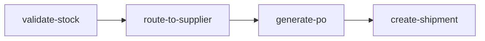

# Workflow engine

## Overview

DropFlow runs a DAG-based workflow engine on [BullMQ](https://docs.bullmq.io/). When an order is created, the web app enqueues a job on the order queue; the worker loads an active workflow definition for trigger `order.created` (or falls back to the built-in `ORDER_FULFILLMENT_DAG`) and executes it via `executeWorkflow`. The default graph is a four-step **order fulfillment** pipeline: steps run in topological order according to `dependsOn` edges.

## DAG architecture



Node `id` values match step registry keys and BullMQ audit semantics: `validate-stock`, `route-to-supplier`, `generate-po`, `create-shipment`.

## Workflow context

`WorkflowContext` is defined in `apps/worker/src/dag/types.ts`:

| Field | Type | Role |
|-------|------|------|
| `tenantId` | `string` | Tenant scope for Prisma writes and SSE channel |
| `orderId` | `string` | Order being fulfilled |
| `workflowRunId` | `string` | `WorkflowRun` row updated during execution (status, `currentStep`, `auditLog`) |
| `triggerId` | `string` | For order fulfillment this equals `orderId` (set in `order-worker.ts`) |
| `data` | `Record<string, unknown>` | Accumulated outputs from prior steps; merged before each handler runs |

Supporting types:

- **`StepResult`**: `{ success: boolean; data?: Record<string, unknown>; error?: string }`
- **`DAGNode`**: `{ id, label, handler, dependsOn[], config? }` — `handler` is the registry key (e.g. `"validate-stock"`).
- **`DAGDefinition`**: `{ nodes: DAGNode[] }`

## Step handlers

| Step | Handler | What it does | Side effects | Output `data` |
|------|---------|--------------|--------------|---------------|
| `validate-stock` | `validateStock` | Loads order with items and products; for each line checks `product.stockQty - product.reservedQty >= item.quantity`. | On success only: `product.reservedQty` incremented by line quantity for each item. | `{ itemsValidated: number }` (order line count) |
| `route-to-supplier` | `routeToSupplier` | Collects distinct `supplierId`s from order items (via `product.supplier`); uses first item’s supplier as primary. | `order.status` → `ROUTING`; `OrderStatusHistory` with note including supplier name. | `{ supplierId, supplierName, supplierCount }` |
| `generate-po` | `generatePO` | Reads `ctx.data.supplierId` or falls back to first line’s `product.supplierId`; sums `item.totalPaise`. | `PurchaseOrder` created (`status` `SENT`, `sentAt` set); `order.status` → `PO_CREATED`; `OrderStatusHistory`. | `{ poId, poNumber }` |
| `create-shipment` | `createShipment` | If no `Shipment` for `orderId`, creates one (`carrier` `SELF`, `trackingStatus` `PENDING`). | New shipment when needed: `order.status` → `PROCESSING`; `OrderStatusHistory`. If shipment already exists, order status/history are not updated. | `{ shipmentId }`, or `{ shipmentId, status: "already_exists" }` when idempotent short-circuit |

Handlers are registered in `apps/worker/src/dag/step-registry.ts` under the same string keys as `DAGNode.handler`. The default DAG lives in `apps/worker/src/dag/default-workflows.ts` as `ORDER_FULFILLMENT_DAG`.

## Executor logic

Implementation: `apps/worker/src/dag/executor.ts`.

1. **Topological sort** — DFS-based ordering of `dag.nodes`; detects cycles and missing nodes.
2. **Sequential execution** — Sorted nodes run one after another; dependencies are satisfied by sort order.
3. **Merged context** — For each step, `mergedCtx.data` starts as a shallow copy of `ctx.data`, then each prior step’s `result.data` is merged with `Object.assign` (later steps see all earlier outputs).
4. **Persistence** — Before each step: `WorkflowRun.currentStep` updated. After each step: `auditLog` appended with `step`, `status` (`completed` / `failed`), ISO `timestamp`, optional `data` / `error`.
5. **On failure** — `WorkflowRun.status` → `FAILED`, `failedAt` and `errorMessage` set; relevant SSE events (see below); execution stops and returns `{ success: false, failedStep?, error? }`.
6. **On success** — After all nodes: `WorkflowRun.status` → `COMPLETED`, `completedAt` set, `currentStep` cleared; `WORKFLOW_COMPLETED` broadcast.

If no handler is registered for `node.handler`, the run is marked `FAILED` without running user code. If a handler **throws**, the run is still marked `FAILED`, but only `WORKFLOW_STEP` with `status: "failed"` is broadcast for that case (no `WORKFLOW_FAILED` event in the current implementation). `WORKFLOW_FAILED` is emitted when the handler returns `success: false`.

## BullMQ queues

Queue name constants come from `@dropflow/config` (`QUEUE_NAMES`) and are wired in `apps/worker/src/queues/index.ts`:

| Queue name | Constant | Purpose in codebase |
|------------|----------|---------------------|
| `order-queue` | `QUEUE_NAMES.ORDER` | Order fulfillment DAG; worker in `apps/worker/src/workers/order-worker.ts` |
| `inventory-queue` | `QUEUE_NAMES.INVENTORY` | Queue created; no worker processor in-repo at time of writing |
| `invoice-queue` | `QUEUE_NAMES.INVOICE` | Same |
| `shipping-queue` | `QUEUE_NAMES.SHIPPING` | Same |

**Order job payload** (typed in `order-worker.ts` as `OrderJobPayload`):

```ts
{ tenantId: string; orderId: string }
```

Jobs are enqueued from the web app (e.g. order creation) via the worker `POST /internal/enqueue` with body matching `EnqueueJobInput` in `@dropflow/types` (`queue` + `payload` + optional `options`). Non-order queues accept the same envelope; `payload` is `Record<string, unknown>` until those flows define a stricter shape.

## SSE events

The worker broadcasts tenant-scoped events through `apps/worker/src/sse/broadcaster.ts` (`broadcast(tenantId, event)`). The `SSEEvent` shape is:

```ts
{
  type: string;
  workflowRunId?: string;
  step?: string;
  status?: string;
  data?: unknown;
}
```

Workflow-related `type` values emitted by the executor:

| Event `type` | When | Typical fields |
|--------------|------|----------------|
| `WORKFLOW_STARTED` | After successful DAG sort, before any step | `workflowRunId`; `data`: `{ orderId, steps: string[] }` (ordered step ids) |
| `WORKFLOW_STEP` | Start, completion, or failure of a step | `workflowRunId`, `step` (node id), `status`: `"running"` \| `"completed"` \| `"failed"`; `data` absent for `running`; on `completed`, handler `result.data`; on `failed`, `{ error: string }` |
| `WORKFLOW_COMPLETED` | All steps succeeded | `workflowRunId`; `data`: `{ orderId }` |
| `WORKFLOW_FAILED` | Step returned `success: false` | `workflowRunId`; `data`: `{ failedStep: string, error?: string }` |

If no SSE clients are connected for the tenant, broadcasts are skipped (no-op aside from logging).

## Adding a new step

1. Implement the handler in `apps/worker/src/dag/steps/<name>.ts`, returning `Promise<StepResult>` and using `WorkflowContext` / Prisma like existing steps.
2. Register it in `apps/worker/src/dag/step-registry.ts` (`STEP_REGISTRY` key must match `DAGNode.handler`).
3. Add a `DAGNode` to the tenant or default DAG in `apps/worker/src/dag/default-workflows.ts` (or store an updated `dagJson` on `WorkflowDefinition` for `order.created`).
4. Update this document: diagram, step table, and changelog.

## Changelog

- **2026-03-30:** Initial workflow engine with 4-step order fulfillment DAG.
